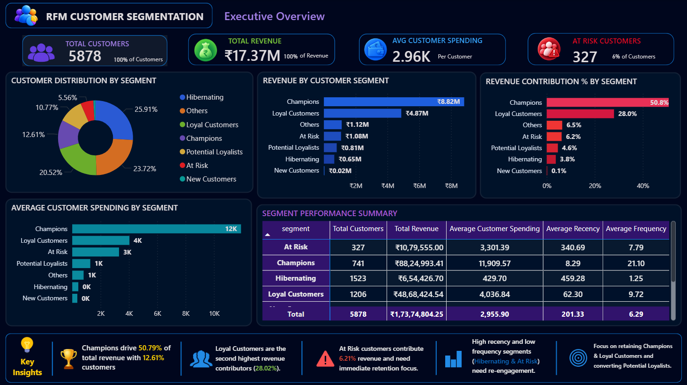
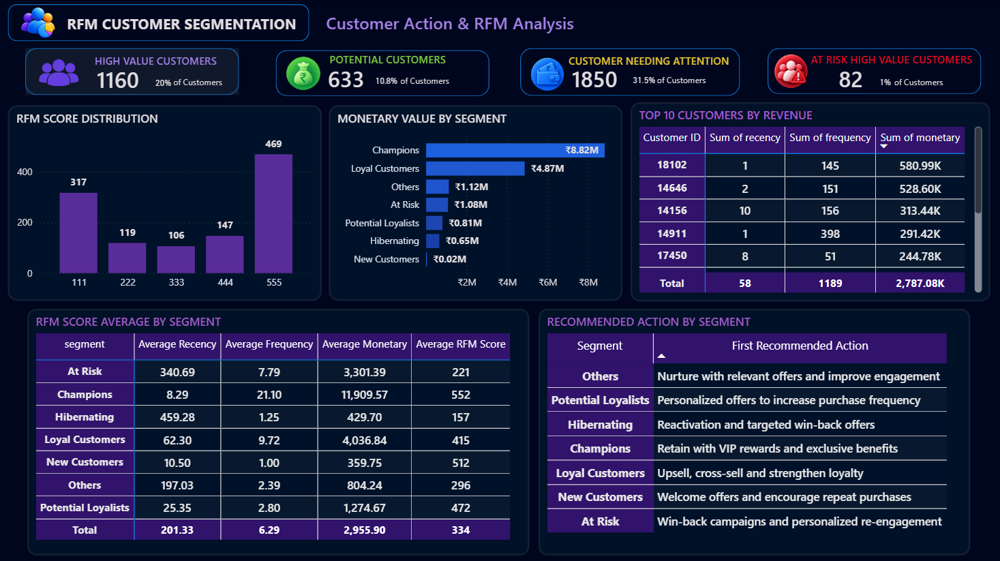

# Customer Segmentation & RFM Revenue Optimization

An end-to-end customer analytics project using **RFM (Recency, Frequency, Monetary) analysis** to segment customers, identify high-value and at-risk customers, analyze revenue contribution, and generate actionable business insights.
The project uses the **Online Retail II** dataset and combines **Python, PostgreSQL, SQL, and Power BI** to transform raw transactional data into customer-level insights.

---

## 📌 Project Overview

Understanding customer purchasing behavior is important for improving retention, increasing customer value, and identifying customers who may require re-engagement.
This project applies **RFM Analysis** to evaluate customers based on:

- **Recency** — How recently a customer purchased
- **Frequency** — How frequently a customer purchased
- **Monetary** — How much a customer spent

Customers are then classified into meaningful segments and analyzed using SQL and Power BI.

---

## 🎯 Business Objectives

The project aims to help a retail business:

- Identify high-value customers
- Understand customer purchasing behavior
- Identify customers at risk of becoming inactive
- Identify potential loyal customers
- Analyze revenue contribution by customer segment
- Find the highest-value customers
- Prioritize customer retention and reactivation strategies
- Convert customer data into actionable business insights

---

## 🗂️ Dataset

**Dataset:** Online Retail II

The dataset contains transactional records from an online retail business.

### Key Columns

| Column | Description |
|---|---|
| Invoice | Transaction/invoice number |
| StockCode | Product code |
| Description | Product description |
| Quantity | Number of units purchased |
| InvoiceDate | Transaction date and time |
| Price | Unit price |
| Customer ID | Customer identifier |
| Country | Customer country |
| Total Price | Calculated transaction value |

---

## 🛠️ Tech Stack

### Programming & Analysis
- Python
- Pandas
- NumPy
- Jupyter Notebook

### Database & SQL
- PostgreSQL
- SQL
- pgAdmin

### Visualization & BI
- Power BI
- DAX
- Power Query

### Version Control
- Git
- GitHub

---

# 🔄 Project Workflow

```text
Online Retail II Dataset
          ↓
     Data Cleaning
          ↓
   Feature Engineering
          ↓
      RFM Analysis
          ↓
 Customer Segmentation
          ↓
      PostgreSQL
          ↓
    SQL Business Analysis
          ↓
      Power BI
          ↓
 Business Insights & Actions
```

---

 🧹 1. Data Cleaning & Preparation

The raw transactional dataset was cleaned and prepared using Python and Pandas.

Key Steps
Loaded the Online Retail II dataset
Converted InvoiceDate to datetime
Removed records with missing transaction dates
Converted Customer ID to an appropriate numeric format
Removed duplicate records
Created the Total Price column
Revenue Calculation

Python Code:
```python
df["Total Price"] = df["Quantity"] * df["Price"]
```

After cleaning, the processed dataset contained:
779,425 transaction records

---

📊 2. RFM Analysis

RFM analysis was performed at the customer level.

Recency

Recency measures how recently a customer made a purchase.
Recency = Snapshot Date - Last Purchase Date
A lower Recency value indicates a more recent purchase.

Frequency

Frequency measures how often a customer purchased.
Frequency = Number of Unique Invoices
A higher Frequency indicates more frequent purchasing behavior.

Monetary

Monetary measures the total historical value generated by a customer.
Monetary = Total Customer Revenue
A higher Monetary value indicates greater historical customer value.

---

🔢 3. RFM Scoring

Customers were scored across the three RFM dimensions:
Recency Score
Frequency Score
Monetary Score

The individual scores were combined into an RFM score.
The individual RFM scores were combined to create a three-digit RFM score.

For example:
111 = R Score 1, F Score 1, M Score 1
555 = R Score 5, F Score 5, M Score 5

The final customer-level RFM dataset contains:
Customer ID
Recency
Frequency
Monetary
R_Score
F_Score
M_Score
RFM_Score
Segment

---

👥 4. Customer Segmentation

The RFM analysis classified customers into the following segments:
| Segment             | Customers |
| ------------------- | --------: |
| Hibernating         |     1,523 |
| Others              |     1,394 |
| Loyal Customers     |     1,206 |
| Champions           |       741 |
| Potential Loyalists |       633 |
| At Risk             |       327 |
| New Customers       |        54 |
| **Total**           | **5,878** |

---

💰 5. Key Business Insights
Customer Distribution
Hibernating is the largest customer segment with 1,523 customers, representing a significant inactive customer base.
This creates an opportunity for targeted reactivation and win-back campaigns.

Revenue Contribution
Revenue contribution varies significantly across customer segments.
| Segment             | Revenue Contribution |
| ------------------- | -------------------: |
| Champions           |               50.79% |
| Loyal Customers     |               28.02% |
| Others              |                6.45% |
| At Risk             |                6.21% |
| Potential Loyalists |                4.64% |
| Hibernating         |                3.77% |
| New Customers       |                0.11% |

Champions and Loyal Customers together contribute 78.81% of total revenue.
This highlights the importance of customer retention among high-value segments.

Champions :
Champions have the highest average customer spending:
₹11,909.57
This segment represents customers with strong historical purchasing behavior.

Highest-Value Champion :
The highest-value Champion identified in the analysis is:
Customer ID: 18102
Historical monetary value:
₹580,987.04

---

🗄️ 6. PostgreSQL & SQL Analysis

The customer-level RFM dataset was loaded into PostgreSQL for structured business analysis.

The SQL analysis answers questions including:

How many customers are in each RFM segment?
Which segments contribute the most revenue?
Which segments have the highest average customer spending?
Who are the top 5 Champions by monetary value?
How many high-value customers are At Risk?
Which customer segments should receive different business actions?
Who are the top 10 customers by monetary value?
What percentage of total revenue comes from each segment?

SQL scripts are available in:
sql/
└── 01_RFM_Business_Analysis.sql

---

📈 7. Power BI Dashboard

The Power BI dashboard contains two analytical pages.

Page 1 — Executive Overview

The Executive Overview provides a high-level view of customer and revenue performance.

Dashboard Components
Total Customers
Total Revenue
Average Customer Spending
At Risk Customers
Customer Distribution by Segment
Revenue by Segment
Revenue Contribution by Segment
Average Customer Spending by Segment
Segment Performance Summary
Key Business Insights
Dashboard Preview :


🎯 Page 2 — Customer Action & RFM Analysis

The second dashboard page focuses on customer-level analysis and business actions.

Dashboard Components
High Value Customers
At Risk High Value Customers
Customers Needing Attention
Potential Customers
RFM Score Distribution
Monetary Value by Segment
RFM Profile by Segment
Top 10 Customers by Revenue
At Risk Customer Analysis
Recommended Action by Segment
Dashboard Preview :


---

📌 Overall Dataset Metrics
| Metric                    |          Value |
| ------------------------- | -------------: |
| Total Customers           |          5,878 |
| Total Revenue             | ₹17,374,804.25 |
| Average Customer Spending |        ~₹2.96K |
| At Risk Customers         |            327 |
| Champions                 |            741 |
| Loyal Customers           |          1,206 |
| Potential Loyalists       |            633 |
| Hibernating               |          1,523 |

---

💡 Recommended Business Actions
| Segment             | Recommended Action                                                  |
| ------------------- | ------------------------------------------------------------------- |
| Champions           | Retain with VIP rewards, exclusive benefits and personalized offers |
| Loyal Customers     | Upsell, cross-sell and strengthen loyalty engagement                |
| Potential Loyalists | Use personalized offers to increase purchase frequency              |
| Others              | Nurture with relevant offers and improve engagement                 |
| At Risk             | Run win-back campaigns and personalized re-engagement               |
| Hibernating         | Use reactivation and targeted win-back campaigns                    |
| New Customers       | Provide welcome offers and encourage repeat purchases               |

---

📁 Project Structure
```text
RFM-Customer-Segmentation/
│
├── data/
│   ├── 01. Raw Data/
│   │   └── online_retail_II.csv
│   │
│   └── 02. Processed Data/
│       └── cleaned_retail.csv
│
├── notebooks/
│   └── RFM_Customer_Segmentation.ipynb
│
├── sql/
│   └── 01_RFM_Business_Analysis.sql
│
├── powerbi/
│   └── RFM_Customer_Segmentation.pbix
│
├── images/
│   ├── 01_Executive_Overview.png
│   └── 02_Customer_Action_&_RFM_Analysis.png
│
├── requirements.txt
└── README.md
```
---

🚀 Skills Demonstrated

This project demonstrates practical experience in:

- Data Cleaning
- Data Transformation
- Exploratory Data Analysis
- Feature Engineering
- RFM Analysis
- Customer Segmentation
- Python
- Pandas
- NumPy
- PostgreSQL
- SQL
- Power BI
- DAX
- Data Visualization
- Business Intelligence
- Customer Retention Analytics
- Business Insight Generation

--- 

🔍 Analytical Approach

The project follows a structured analytics approach:

1. Understand

Analyze transactional data and customer purchasing behavior.

2. Prepare

Clean the raw dataset and create customer-level analytical features.

3. Segment

Apply RFM scoring and classify customers into behavioral segments.

4. Analyze

Use PostgreSQL and SQL to answer business questions and measure segment performance.

5. Visualize

Build an interactive Power BI dashboard to communicate customer and revenue insights.

6. Recommend

Translate analytical findings into segment-specific customer strategies.

---

📌 Conclusion

This project demonstrates an end-to-end customer analytics workflow, from raw transactional data preparation to business-focused visualization and customer segmentation.

By combining Python for data cleaning and RFM analysis, PostgreSQL for structured SQL analysis, and Power BI for interactive reporting, the project identifies valuable customer segments, analyzes revenue concentration, highlights at-risk customers, and provides actionable strategies for customer retention and reactivation.

---

👤 Author
Devraj Prasad

Data Analyst | SQL | Python | Power BI | PostgreSQL

GitHub:
https://github.com/Devraj-prasad07
